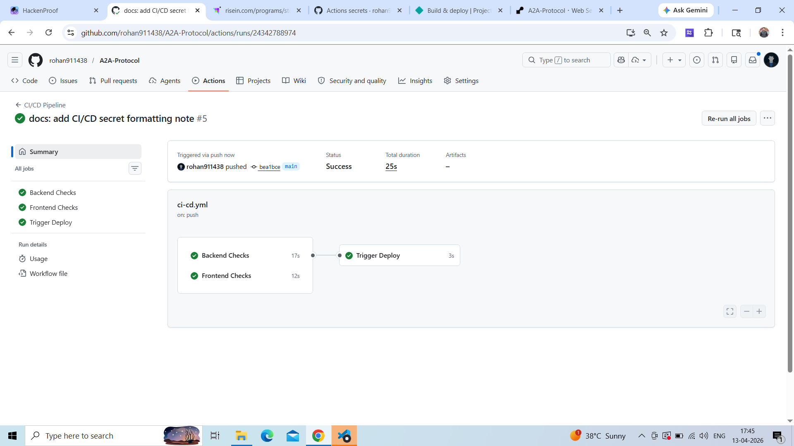
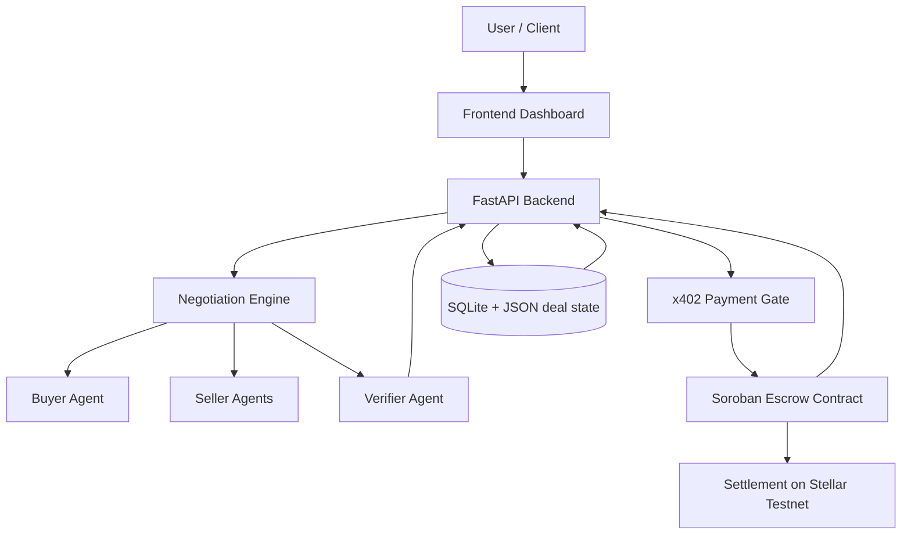

<p align="center">
  
</p>

# A2A Protocol — Autonomous Agents That Negotiate, Transact, and Execute On-Chain

[](https://github.com/rohan911438/A2A-Protocol/actions/workflows/ci-cd.yml)

**Built by Team Brotherhood**

A2A Protocol is a hackathon project for an emerging agent economy: AI agents that can negotiate, authorize payment, settle through escrow, and complete work with on-chain trust guarantees. The product combines autonomous negotiation, Stellar Soroban escrow, x402-style payment gating, and explainable deal summaries so users can define the task while agents handle execution.

## At A Glance

- Define a task once.
- Let agents negotiate the deal.
- Lock funds in on-chain escrow.
- Verify completion before release.
- Keep every critical action auditable.

## Live Deployment

- Frontend: https://a2aprotocol.netlify.app/
- Backend: https://a2a-protocol-rn62.onrender.com
- Backend health check: https://a2a-protocol-rn62.onrender.com/
- Video Link - https://youtu.be/3KrVJvXWhu8?si=Ixmrt1isNr5Y-pZn
- CI/CD workflow file: `.github/workflows/ci-cd.yml`
- CI/CD badge: added at top of this README
- Live demo (frontend): https://a2aprotocol.netlify.app/
- Live API (backend): https://a2a-protocol-rn62.onrender.com
- Escrow contract address: `CDKOZ25IENHQFRRNTJDXAYAOUSDBPUXLE52UGTNIPWACAMGAMNXMYTQU`
- Token contract address: `CB5YMKKIGH7UFLWDNZRH5P5ENXE7VQIOJSA2FDVQQB3Z7AEUIFQOEFTI`
- Workflow Video (RiseIn): https://youtu.be/r3UFY5QrDqk?si=7DQqfipm-GlNOP0E
- Feedback from testnet users: https://docs.google.com/spreadsheets/d/1SDXTvTbcdmux87zRt8ZENfPvrhMRcFtBTl6SMnnYIhE/edit?usp=sharing

## CI/CD pipeline success screenshot:




## Problem Statement

Today’s AI agents can reason, plan, and automate work, but they still lack the native ability to participate in real economic activity.

The gaps are structural:

- Agents cannot natively negotiate contracts with counterparties.
- Payment risk still depends on manual coordination or trusted intermediaries.
- Buyers and sellers do not have a trustless way to lock funds before work begins.
- Execution is slow because confirmation, authorization, and settlement happen in separate systems.
- Marketplaces still rely on human back-and-forth for pricing, milestones, and completion checks.

The result is friction everywhere: delayed deals, unclear obligations, failed handoffs, and weak trust between parties.

## Our Solution

A2A Protocol turns agents into active economic participants.

The system lets a buyer define a task once, then the protocol coordinates the rest: buyer and seller agents negotiate, a verifier agent checks completion, and Stellar-based escrow secures payment until the work is confirmed. For sensitive steps, x402-style payment authorization gates critical actions so the platform can require explicit payment before releasing contracts, summaries, or settlement workflows.

The core idea is simple: users express intent, while agents negotiate, transact, and execute on-chain with guardrails.

## Key Features

- Autonomous agent negotiation for pricing, timing, and acceptance.
- On-chain escrow using Stellar Soroban.
- x402-style payment gating for authorization-sensitive actions.
- Explainable AI decision-making with reasoning summaries.
- Verifier agent support for trustless completion checks.
- Smart Deal Summary for readable deal state, risk, and milestones.
- One-click Demo Mode for fast walkthroughs during judging.
- Agent reputation and activity tracking for negotiation context.

## Architecture Overview



### 1. User Layer

Users submit tasks, connect a Stellar wallet, and define deal preferences such as budget, deadline, and seller criteria.

### 2. Agent Layer

Buyer agents represent demand, seller agents compete or respond, and verifier agents confirm delivery and completion conditions.

### 3. Intelligence Layer

The negotiation engine applies pricing logic, offer history, deadline pressure, and reputation signals to generate structured decisions.

### 4. Payment Layer

x402-style micropayments authorize critical actions, while Stellar transactions handle escrow funding, release, and settlement.

### 5. Trust Layer

Soroban smart contracts hold funds and enforce escrow rules so settlement can happen without relying on a central intermediary.

## Workflow

1. User submits a task.
2. Buyer agent is created.
3. Seller agents bid or respond.
4. Agents negotiate until terms converge.
5. Smart Deal Summary is generated.
6. x402 payment authorization is required for gated actions.
7. Escrow contract is created on Stellar.
8. Work is submitted.
9. Verifier agent validates completion.
10. Payment is released from escrow.

## Architectural Diagram Notes

The architecture is intentionally modular so each layer can evolve independently.

- The frontend focuses on user intent, wallet connection, and deal visibility.
- The backend coordinates negotiation, persistence, and payment gating.
- The agent layer handles offer generation, bargaining, and verification.
- The trust layer is enforced by Soroban escrow rather than by a central operator.

## Tech Stack

- Frontend: React (Vite), Tailwind CSS
- Backend: FastAPI (Python)
- AI: LLM-based negotiation system
- Blockchain: Stellar + Soroban
- Wallets: Freighter, Rabet
- Database: SQLite with JSON-backed deal state

## Smart Contracts & Deployment

- Escrow contract address: `CDKOZ25IENHQFRRNTJDXAYAOUSDBPUXLE52UGTNIPWACAMGAMNXMYTQU`
- Token contract address: `CB5YMKKIGH7UFLWDNZRH5P5ENXE7VQIOJSA2FDVQQB3Z7AEUIFQOEFTI`
- Network: Stellar Testnet
- RPC endpoint: `https://soroban-testnet.stellar.org:443`

Testnet verification links:

- Escrow contract explorer: https://stellar.expert/explorer/testnet/contract/CDKOZ25IENHQFRRNTJDXAYAOUSDBPUXLE52UGTNIPWACAMGAMNXMYTQU
- Token contract explorer: https://stellar.expert/explorer/testnet/contract/CB5YMKKIGH7UFLWDNZRH5P5ENXE7VQIOJSA2FDVQQB3Z7AEUIFQOEFTI
- Soroban RPC endpoint: https://soroban-testnet.stellar.org:443

Contract verification note: open the escrow contract explorer link above to confirm the deployed contract exists on Stellar Testnet and matches the on-chain address used by the app.

Escrow logic overview:

- Funds are locked in a Soroban escrow contract.
- A verifier or authorized participant confirms completion.
- Settlement is released only when the correct on-chain conditions are met.
- x402-style authorization is used to gate sensitive operations before proceeding.

## Go-To-Market Strategy

A2A Protocol starts with a clear wedge: freelance-style work coordination where trust, payment, and delivery are the main pain points. The GTM strategy is designed to prove value early, then expand into broader agent commerce.

### Phase 1: Prove the Wedge

- Target freelance-style tasks where payment disputes are common.
- Demonstrate fast negotiation plus escrow-backed settlement.
- Use Demo Mode to show the full flow in under three minutes.

### Phase 2: Expand Usage

- Extend from one-off freelance tasks to repeatable service requests.
- Introduce more structured deal templates and agent reputation history.
- Make the protocol useful for startups outsourcing small, high-trust tasks.

### Phase 3: Open the Agent Economy

- Expose the negotiation and escrow workflow as an API.
- Let external agents plug into the protocol.
- Enable recurring, machine-to-machine economic activity.

Target users:

- Freelancers and clients
- Startups that outsource modular work
- AI developers building agent workflows
- Web3 users already comfortable with wallet-based execution

Execution strategy:

1. Lead with a clear demo that shows negotiation, escrow, and settlement end to end.
2. Convert the demo into a repeatable workflow for freelancers and clients.
3. Use integrations and partnerships to move from a project demo to a protocol layer.

## Comparison

| Capability | Traditional Marketplace | Generic AI Agent | A2A Protocol |
|---|---|---|---|
| Negotiation | Manual messaging | Can draft responses | Autonomous agent-to-agent negotiation |
| Payment | Off-chain or manual | No native payment flow | x402-style payment gating + on-chain escrow |
| Trust | Platform-mediated | No trust layer | Verifier agent + Soroban settlement |
| Completion | Human review | Best-effort reasoning | Explicit completion path before release |
| Auditability | Fragmented records | Limited traceability | Structured summaries and on-chain state |
| Economic agency | Human-only | Advisory only | Agents participate directly in workflow |

### Why It Is Different

- Traditional marketplaces coordinate humans.
- Generic AI agents can assist, but they do not settle value safely.
- A2A Protocol combines negotiation, payment authorization, and escrow into one workflow so agents can actually operate in the economy.

## Screenshots


## Demo Video

Video Link - https://youtu.be/3KrVJvXWhu8?si=Ixmrt1isNr5Y-pZn


## How to Run Locally

### Prerequisites

- Python 3.11+
- Node.js 20+
- npm

### Backend

1. Install Python dependencies:

   ```bash
   python -m pip install -r requirements.txt
   ```

2. Create a root `.env` file with API keys, wallet addresses, and contract IDs.

3. Start the backend:

   ```bash
   python -m backend.main
   ```

4. Backend runs at:

   ```text
   http://127.0.0.1:8000
   ```

### Frontend

1. Move into the frontend directory:

   ```bash
   cd frontend
   ```

2. Install dependencies:

   ```bash
   npm install
   ```

3. Create `frontend/.env`:

   ```env
   VITE_API_BASE=http://127.0.0.1:8000
   VITE_HORIZON_URL=https://horizon-testnet.stellar.org
   VITE_NETWORK_PASSPHRASE=Test SDF Network ; September 2015
   VITE_STELLAR_NETWORK=TESTNET
   ```

4. Start the frontend:

   ```bash
   npm run dev
   ```

### Production Frontend Deployment

`netlify.toml` is already configured for the frontend build with:

- Base directory: `frontend`
- Build command: `npm ci && npm run build`
- Publish directory: `dist`

Set these environment variables in Netlify:

```env
VITE_API_BASE=https://a2a-protocol-rn62.onrender.com
VITE_HORIZON_URL=https://horizon-testnet.stellar.org
VITE_NETWORK_PASSPHRASE=Test SDF Network ; September 2015
VITE_STELLAR_NETWORK=TESTNET
```

After deployment, add the Netlify domain to backend CORS settings in Render.

## User Feedback & Implementation

### Table 1: Testnet User Information

| User Name | User Email | User Wallet Address |
| :--- | :--- | :--- |
| Debojyoti De Majumder | ddmpersonalworkspace@gmail.com | GDPRBMUSTPXRDFP5STCWOG4US7TOHTKLXZTXMAKDMCLBO5FMIIZ6O54R |
| Punit | founder@builderbase.xyz | GD7UFEHE4J3RKQ25ZDGGJ4VBUWATV645UUMN4JYDIBMSFCSFOWXSQ6LM |
| Shashwat Shukla | shash.hashed@gmail.com | GBVC7GUZZDXSVMJ6VFHRGMDDDZQJTVSF4WKKNHHLGOSM2QJJVAHEQSUG |
| Harsh Jain | harshjainhp15s@gmail.com | GAYC3UV3PT7HPPAXC5YLYJHUSX6VKFVBYZ5JX6SOJOCJPI76VQN64RYQ |
| Abhishek Singh | abhisheksingh4928@gmail.com | GBBJTJPZOLVQNBHZ2TEIFWR4V62ULDY7LETCCVOAA3IBDPPDRUHTM3UQ |
| Sriz Debnath | srizd449@gmail.com | GJDMMFBBRMMDKXKXNNZSSIKSKENDBEVSHJXKKDKDJDJD |
| Mannu | mannusingh4678@gmail.com | GBZ44OAWEQMKHQ5H4SOZOSM5I6G6RXMJ5JYOG2ODYJPLFWUKYV3XCM4Y |
| Soumajit Goswami | soumajitgoswami4@gmail.com | GA5EZJZ7YLPROX6A76YDLTW7IJ7WSHEYI5GRI7KAOJOY46MTGCDKLD3C |

### Table 2: User Feed Implementation

| User Name | User Email | User Wallet Address | User Feedback | Commit ID |
| :--- | :--- | :--- | :--- | :--- |
| Debojyoti De Majumder | ddmpersonalworkspace@gmail.com | GDPRBMUSTPXRDFP5STCWOG4US7TOHTKLXZTXMAKDMCLBO5FMIIZ6O54R | Better UI and handling of agents, faster agent communication | `cbba947` |
| Punit | founder@builderbase.xyz | GD7UFEHE4J3RKQ25ZDGGJ4VBUWATV645UUMN4JYDIBMSFCSFOWXSQ6LM | Positive feedback, no issues reported | `b9fde95` |
| Shashwat Shukla | shash.hashed@gmail.com | GBVC7GUZZDXSVMJ6VFHRGMDDDZQJTVSF4WKKNHHLGOSM2QJJVAHEQSUG | Multisig support and frontend UI improvements | `cbba947` |
| Harsh Jain | harshjainhp15s@gmail.com | GAYC3UV3PT7HPPAXC5YLYJHUSX6VKFVBYZ5JX6SOJOCJPI76VQN64RYQ | Everything is smooth, confirmed effective problem solving | `152cc8f` |
| Abhishek Singh | abhisheksingh4928@gmail.com | GBBJTJPZOLVQNBHZ2TEIFWR4V62ULDY7LETCCVOAA3IBDPPDRUHTM3UQ | UI can be better, agents conversation improved | `cbba947` |
| Sriz Debnath | srizd449@gmail.com | GJDMMFBBRMMDKXKXNNZSSIKSKENDBEVSHJXKKDKDJDJD | Albedo wallet connection problem addressed | `152cc8f` |
| Mannu | mannusingh4678@gmail.com | GBZ44OAWEQMKHQ5H4SOZOSM5I6G6RXMJ5JYOG2ODYJPLFWUKYV3XCM4Y | Frontend can be improved, overall loved the product | `cbba947` |
| Soumajit Goswami | soumajitgoswami4@gmail.com | GA5EZJZ7YLPROX6A76YDLTW7IJ7WSHEYI5GRI7KAOJOY46MTGCDKLD3C | UI can be better, agent interaction confirmed | `cbba947` |

## Future Scope

- Cross-chain support for broader settlement options.
- More advanced agent intelligence and negotiation policy learning.
- Real-world integrations with freelance, API, and marketplace platforms.
- Decentralized identity for stronger agent and user trust signals.

## Team

Team: Brotherhood

- Rohan Kumar (@rohan911438) - Solo founder, product, backend, frontend, and smart contract integration.

## Why It Matters

A2A Protocol lays the foundation for a future where AI agents are not just tools, but autonomous economic participants.

It makes agent collaboration economically useful by combining negotiation, escrow, payment gating, and transparent completion logic into one workflow that is understandable to users and credible to judges, developers, and real-world adopters.

## Repository Structure

- `backend/`: FastAPI routes, services, persistence, and Stellar integration.
- `frontend/`: React + Vite UI and wallet interactions.
- `smart_contract/`: Soroban escrow contract and deployment scripts.
- `Agents/`: negotiation, strategy, and reasoning logic.
